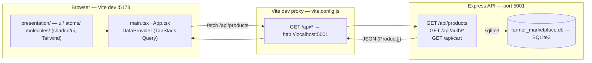
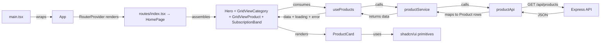

# 🌾 Farm Marketplace

## GOAL
Build a production-grade web marketplace with React + Vite + TypeScript and an Express/SQLite backend. Apply React Best Practices, use **shadcn/ui as the base design UI/UX system** (accessible, themeable primitives), and solve common blank page issues.

---

## STACK

| Layer | Technology |
|-------|-----------|
| Frontend | React 18, Vite 5, TypeScript |
| UI/UX System | shadcn/ui (Radix UI primitives) — design tokens in `src/infrastructure/css/` |
| Styling | Tailwind CSS v4 |
| Server State | TanStack Query v5 (`@tanstack/react-query`) |
| Routing | TanStack Router v1 (`@tanstack/react-router`) file-based routes in `src/routes/` |
| Backend | Express 4, SQLite3 |
| Build | `tsc && vite build` |
| Build | `tsc && vite build` |

---

## HIGH-LEVEL ARCHITECTURE



### Data flow (presentation → application → infrastructure → domain)



**Layer sequence (a request lifecycle):**
1. `DataProvider` (`QueryClientProvider`) wraps the app tree — every query goes through the shared `queryClient` with `staleTime`/`gcTime`/`retry` defaults.
2. `App` renders the `RouterProvider`, which renders the matched `src/routes/` file route; the home route (`index.tsx`) renders the page module, which assembles `Header`, `Hero`, `GridViewCategory`, `GridViewProduct`, `SubscriptionBand`, `Footer`.
3. `GridViewProduct` calls `useProducts()` (Presentation → Application hook).
4. `useProducts` calls `productService.getProducts()` (Application → Application service).
5. `productService` calls `productApi.fetchProducts()` (Application → Infrastructure/fetch).
6. `productApi` calls `GET /api/products` and maps the response into typed `Product` domain objects.

### Component rendering rules
- **Every molecule renders the primitives it needs.** Build UI out of **shadcn/ui primitives first** (`ui/Button`, `ui/Card`, `ui/Input`, `ui/Badge`, `ui/Alert`), then compose them into atoms/molecules/page modules. `GridViewProduct` and `ProductCard` are composed from primitives — do not re-implement an already-existing primitive in Presentation.

---

## LAYER ARCHITECTURE

```
src/
├── main.tsx                    # ReactDOM render + DataProvider wrap + CSS import
├── App.tsx                     # Root component (renders RouterProvider)
├── vite-env.d.ts               # CSS module declarations
├── domain/
│   └── types/
│       └── product.ts          # Product, ProductCategory, ProductApiResponse
├── application/
│   ├── hooks/
│   │   └── useProducts.ts      # TanStack Query hook for products
│   ├── services/
│   │   └── productService.ts   # API abstraction (getProducts)
│   └── providers/
│       └── DataProvider.tsx    # QueryClient + Provider + Devtools
├── infrastructure/
│   ├── api/
│   │   └── productApi.ts       # fetch('/api/products') implementation
│   ├── cache/
│   │   └── queryKeys.ts        # query key factory
│   └── css/
│       └── index.css           # shadcn/ui tokens (@layer base vars) + Tailwind v4 @theme
├── routes/
│   ├── __root.tsx              # root layout (Header/Footer/Outlet) + notFoundComponent
│   ├── index.tsx               # `/` home (Hero, GridViewCategory, GridViewProduct, SubscriptionBand)
│   ├── category.tsx            # `/category` browsing page
│   ├── cat.$categoryId.tsx     # `/cat/$categoryId` category detail
│   ├── det.$categoryId.$productId.tsx # `/det/$categoryId/$productId` product detail
│   └── home/, cat/, det/, category/   # page module subcomponents (-prefixed, ignored by generator)
└── presentation/
    └── components/
        ├── ui/                 # shadcn/ui primitives (Button, Card, Input, Badge, Alert, Dialog)
        ├── atoms/              # Header, BrandWordmark, Pill, ProductCard (leaf/sun), NotFoundPage
        └── molecules/          # GridViewProduct, GridViewCategory, ProductList, ProductToolbar
```

The `ui/` folder holds our local copies of shadcn/ui primitives — modify them directly there.

**File routing (`src/routes/`):** TanStack file-based routing (`@tanstack/router-plugin` generates `src/routeTree.gen.ts`). Route files export a `Route` via `createFileRoute`. Dot-files map to nested path segments: `cat.$categoryId.tsx` → `/cat/$categoryId`, `det.$categoryId.$productId.tsx` → `/det/$categoryId/$productId`. Subfolder page modules are prefixed with `-` so the generator ignores them as routes (e.g. `routes/home/-Hero.tsx`). `src/router.tsx` builds the router from the generated tree. Invalid `$categoryId`/`$productId` render the shared `NotFoundPage` atom (also the root `notFoundComponent`).

**Dependency Rule:** Lower layers MUST NOT import upper layers.

```
Presentation → Application → Infrastructure → Domain
```

Every boundary holds today:
- `GridViewProduct` imports from `domain/types` + `application/hooks`
- `useProducts` imports from `infrastructure/cache` + `application/services`
- `productService` imports from `infrastructure/api`
- `productApi` imports from `domain/types`

---

## REACT BEST PRACTICES (9 Steps)

### Step 1: TypeScript-First
- Source files are `.tsx` (components) and `.ts` (hooks/services/types)
- Explicit types for all props: `React.FC<Props>`
- No implicit `any` types; `tsc --noEmit` passes in CI
- `.js` is allowed only in `server/` (Express is untyped) and `vite.config.js`

### Step 2: Layer Architecture
Follow the folder layout above. When adding a feature, place it in the correct layer first, then wire through the boundaries. Never import a Presentation file from Application/Infrastructure.

### Step 3: Component Design
- **Maximum 50 lines** per component (routes ≤ 50, modules ≤ 80 with sub-components)
- Extract sub-components when logic > 20 lines
- Single Responsibility Principle (one component = one job)
- Build UI from **shadcn/ui primitives first** (`<Button>`, `<Card>`, `<Input>`, `<Badge>`, `<Dialog>`), then compose into atoms/molecules/page modules. Do not re-implement an already-existing primitive.
- Page/module code lives in `routes/` (TanStack file-based routing). `presentation/` holds only shared components (`ui/ atoms/ molecules/`).

### Step 4: State Management
- **Local State:** `useState` for form inputs, loading flags, UI toggles (`searchQuery` in `GridViewProduct`)
- **Server State:** **TanStack Query** — never store server data in `useState`
- **Global State:** Zustand (recommended, planned for cart/auth — not yet installed)
```typescript
// Server state (REQUIRED pattern)
const { data, isLoading, isError } = useQuery({
  queryKey: queryKeys.products(),
  queryFn: () => productService.getProducts(),
  staleTime: 5 * 60 * 1000,
});

// Caching defaults live in DataProvider
const queryClient = new QueryClient({
  defaultOptions: {
    queries: { staleTime: 5 * 60 * 1000, gcTime: 30 * 60 * 1000, retry: 1 },
  },
});
```

### Step 5: Forms
- Always **controlled components** (`value` + `onChange`)
- Search input is the controlled-form example in this repo (`GridViewProduct.tsx`)
- Use **shadcn/ui `Form`** (React Hook Form + Zod resolver) for any validation when real forms are added

### Step 6: Performance Optimization
- **Query caching:** prefer `staleTime`/`gcTime` over refetching; use `queryKey`s for targeted invalidation
- **List Keys:** Use stable unique IDs (`item.id`), NOT array indices
- **Images:** `loading="lazy"` on product images (`ProductCard`)

### Step 7: Error Boundaries
- Async data loading uses TanStack Query's `isError` state with a fallback UI (see `GridViewProduct`)
- Add a class-based `ErrorBoundary` around async route/page components as routes grow (no blank pages)
- Surface errors with the shadcn/ui **`<Alert>`** component (variant `destructive` for errors)

### Step 8: Testing Standards
- **Required coverage:** 100% for custom hooks and critical business logic
- Use Vitest + React Testing Library
```typescript
it('calls handler when clicked', () => {
  const handler = vi.fn()
  render(<Button onClick={handler}/>)
  fireEvent.click(screen.getByRole('button'))
  expect(handler).toHaveBeenCalled()
})
```

### Step 9: Component Complexity Tiers
| Tier | Max Lines | Example |
|------|-----------|---------|
| Route | ≤50 | `/`, `/cat/$categoryId` |
| Page module | ≤80 | home, category, product detail |
| Atom | ≤20 | `<Header>`, `<Pill>` |
| Molecule | ≤80 | `<GridViewCategory>`, `<GridViewProduct>` (with sub-components) |
| Page | ≤80 | `<HomePage>` |

---

## DESIGN SYSTEM (shadcn/ui base + Farm Marketplace palette)

The visual system follows **shadcn/ui conventions**: semantic HSL CSS variables defined under `@layer base` in `src/infrastructure/css/index.css` (imported once in `main.tsx`), then mapped onto the farm brand palette. This gives us accessible, themeable, Radix-based primitives.

### Semantic tokens (HSL, opacity-friendly)

```
:root {
  --radius: 0.5rem;

  --background: 39 48% 93%;      /* wheat  #F6F1E4 — page background */
  --foreground: 22 30% 22%;      /* soil   #4A3628 — body text */
  --card:       34 56% 96%;      /* cream  #FBF8F1 — card surfaces */
  --card-foreground: 22 30% 22%;

  --primary:       152 33% 17%;  /* forest #1E3B2C — primary actions */
  --primary-foreground: 34 56% 96%;

  --secondary:     105 21% 52%;  /* moss   #7A9B6D — secondary actions */
  --secondary-foreground: 34 56% 96%;

  --muted:         34 20% 90%;   /* washed wheat */
  --muted-foreground: 22 30% 22% / 0.65;

  --accent:        105 21% 52%;  /* moss — decorative accents */
  --accent-foreground: 22 30% 22%;

  --destructive:   10 43% 42%;   /* blood  #A63D2F — errors/danger */
  --destructive-foreground: 34 56% 96%;

  --border:        39 30% 85%;
  --input:         39 30% 85%;
  --ring:          37 76% 54%;   /* honey  #E3A72F — focus rings/selection */
}
```

Brand colors outside the semantic set are still available as Tailwind palette tokens in `@theme` (`forest/pine/moss/honey/wheat/cream/soil/leaf/clay` — see index.css) for pure brand accents.

### Fonts
- `--font-display: "Raleway"` — headlines, wordmark, hero
- `--font-body: "Public Sans"` — body text
Defined in `@theme` under `index.css`, loaded via Google Fonts import at the top of `index.css`.

### Usage rules
- **Prefer shadcn/ui primitives** over hand-rolled controls: `Button`, `Card`, `Input`, `Label`, `Badge`, `Select`, `Dialog`, `Alert`, `Skeleton`, `Table`, `Tabs`, `Popover`, `Toast`, `Drawer`.
- Map each semantic token to Tailwind utilities so `bg-primary`, `text-muted-foreground`, `border-card`, etc. work (`rounded-md` uses `--radius`).
- **Semantic naming:** use `destructive`, not `red`; `muted`, not `gray`.
- **Dark mode optional:** variables live on `:root` + `.dark`. Add `.dark` variants only if dark mode is adopted later; keep the app light-first for now.
- **Accessibility-first:** Radix primitives provide built-in focus traps, ARIA attributes, and keyboard support. Respect contrast (WCAG AA minimum).

### Component customization
Components live in your codebase — modify directly in `src/presentation/components/ui/`. For one-off styling, override with the `className` prop; for repeated usage, add variants in the component's `buttonVariants`/`cva` block.

---

## COMMON PITFALLS & FIXES

| Pitfall | Fix | Category |
|---------|-----|----------|
| State mutation | `{...state, key: newValue}` | State |
| Missing list keys | Use `item.id`, not `i` | Rendering |
| Uncontrolled forms | `useState` (controlled) | Forms |
| Hardcoded API URL | Vite proxy `/api` → `localhost:5001` | Config |
| Storing server data in `useState` | TanStack Query `useQuery` | State |
| No error handling | `isError` + fallback UI | Errors |
| Hand-rolling accessible controls | shadcn/ui primitive | UI |
| Inline styles | Tailwind utility classes | Styling |
| Importing across layers upward | Respect Presentation → App → Infra → Domain | Architecture |

---

## FILES

| File | Purpose |
|------|---------|
| `index.html` | App root + title |
| `vite.config.js` | Vite + React + Tailwind plugins; `/api` proxy to `localhost:5001` |
| `server/index.js` | Express API (port 5001) + DB init/migration + seeding |
| `server/seed.js` | Standalone DB seed script |
| `server/schema-and-seed.sql` | Reference schema + original 3 demo products |

---

## VERIFICATION CHECKLIST

- [ ] `npm run start` (backend :5001) and `npm run dev` (frontend :5173) both run
- [ ] `npm run build` passes (`tsc && vite build`)
- [ ] 8 products with images, titles, "Rp X" prices
- [ ] Search filters products by title
- [ ] Category cards/pills filter products
- [ ] Hover effects on cards (image zoom + lift)
- [ ] Cart buttons trigger console.log (ready for cart integration)
- [ ] Responsive: 4 columns desktop → 1 column mobile (`xl:grid-cols-4` → `grid-cols-1`)
- [ ] All `.tsx` files with explicit types; `tsc` clean
- [ ] No `any` in source (`src/**/*.ts`(x))
- [ ] Component files respect tier line limits
- [ ] Tailwind utility classes only (no inline styles)
- [ ] shadcn/ui primitives preferred over hand-rolled controls
- [ ] No upward layer imports in `src/`

---

## REFERENCES

- shadcn/ui (base of our design system): https://ui.shadcn.com
- shadcn/ui docs mirror: https://ui.shadcn.com/llms.txt
- Tailwind CSS v4: https://tailwindcss.com/docs
- Radix UI primitives: https://radix-ui.com
- React 18: https://react.dev
- Vite: https://vitejs.dev
- TanStack Query: https://tanstack.com/query
- Zustand: https://docs.pmnd.rs/zustand (optional, future cart/auth)
- Code adapted from: [Vercel Agent Skills - React Best Practices](https://github.com/vercel-labs/agent-skills/blob/main/skills/react-best-practices/AGENTS.md)

---

** LAST UPDATE:** 2026-09-26
** OUTPUT:** React 18 + Vite + TS frontend with TanStack Query, shadcn/ui-based design system, Tailwind v4, and Express/SQLite backend.